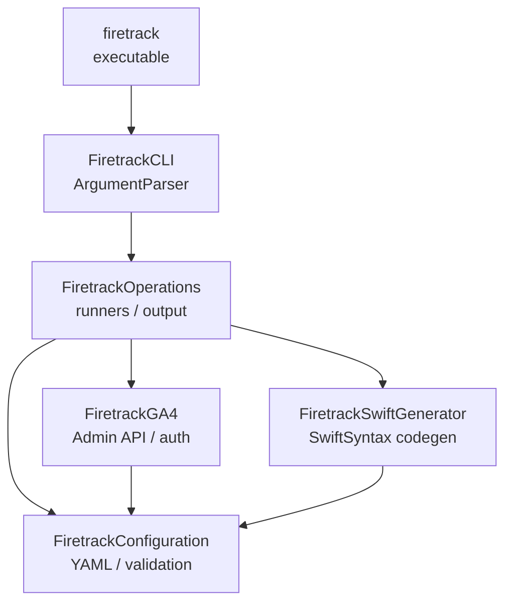

# Firetrack

[](https://github.com/Ryu0118/Firetracker/actions/workflows/test.yml)
[](https://swift.org)
[](https://www.apple.com/macos)
[](LICENSE)

**One YAML file is your analytics contract. Firetrack keeps your code, your GA4 config, and your tracking plan from ever drifting apart.**

Analytics rot the moment three things disagree: the tracking plan in a spreadsheet, the event names hardcoded in your app, and the custom dimensions configured by hand in the GA4 console. Firetrack makes `analytics-tracking-plan.yaml` the single source of truth — it validates the contract, generates type-safe Swift event code, and pushes missing definitions into GA4 over the Admin API. Change the YAML, regenerate, sync. No console clicking, no typo'd event names, no drift.

## Features

- 📋 **One contract, zero drift** — events, parameters, and GA4 dimensions all flow from one validated YAML file
- 🦺 **Type-safe events** — generated Swift enums make a mistyped event name a compile error, not a silent data gap
- ☁️ **Hands-off GA4 setup** — sync custom dimensions, metrics, key events, and BigQuery links straight from the plan, no console required

## Installation

**Install script** — no toolchain needed:

```bash
curl -fsSL https://raw.githubusercontent.com/Ryu0118/Firetracker/main/install.sh | bash
```

<details>
<summary>Other methods (mise, nest, from source)</summary>

```bash
# mise
mise use -g ubi:Ryu0118/Firetracker[exe=firetrack]

# nest — add to nestfile.yaml, then: nest bootstrap nestfile.yaml
#   - reference: Ryu0118/Firetracker
#     version: 0.1.0

# from source (Swift 6.2, macOS 26+)
git clone https://github.com/Ryu0118/Firetracker.git
cd Firetracker && swift build -c release
```

</details>

Verify with `firetrack --version`. Requires **macOS 26+**.

---

## Quick start

1. Write `Documents/analytics-tracking-plan.yaml`:

   ```yaml
   version: 1
   platforms: [ios]
   events:
     recording_completed:
       pii: false
       parameters:
         source:
           type: enum
           required: true
           allowed: [app, widget]
           ga4_custom_dimension: true
         distance_m:
           type: double
           required: true
           ga4_custom_metric: true
   ```

2. Validate it:

   ```bash
   firetrack validate
   ```

3. Generate type-safe Swift:

   ```bash
   firetrack generate --output Sources/Analytics/GeneratedAnalytics.swift --overwrite
   ```

4. Build an event with no stringly-typed names, and log it to Firebase:

   ```swift
   let event = AnalyticsEvent.recordingCompleted(source: .app, distanceM: 1200)
   Analytics.logEvent(event.name, parameters: event.firebaseParameters)
   ```

   See [Logging to Firebase](#logging-to-firebase) for the one-time `firebaseParameters` bridge.

---

## Logging to Firebase

`firetrack generate` emits an `AnalyticsEvent` enum where every case carries its
parameters as compile-checked associated values, plus two computed properties:

```swift
enum AnalyticsEvent {
    case recordingCompleted(distanceM: Double, source: SourceValue)

    var name: String                       // "recording_completed"
    var parameters: [String: AnalyticsValue] // ["distance_m": .double(1200), "source": .string("app")]
}
```

`AnalyticsValue` is a closed enum (`.string` / `.int` / `.double` / `.bool`), so add a
small bridge to Firebase's untyped parameter dictionary **once** — in your app, not in
the generated file:

```swift
import FirebaseAnalytics

extension AnalyticsValue {
    var firebaseValue: Any {
        switch self {
        case let .string(value): value
        case let .int(value): value
        case let .double(value): value
        case let .bool(value): value
        }
    }
}

extension AnalyticsEvent {
    var firebaseParameters: [String: Any] {
        parameters.mapValues(\.firebaseValue)
    }

    /// Logs this event to Firebase Analytics.
    func log() {
        Analytics.logEvent(name, parameters: firebaseParameters)
    }
}
```

Now every call site is type-checked end to end — a wrong parameter name or type is a
compile error, and the event/param strings sent to Firebase always match the plan:

```swift
AnalyticsEvent.recordingCompleted(source: .app, distanceM: 1200).log()
```

---

## The YAML contract

```yaml
version: 1
platforms: [ios]

destinations:
  firebase_analytics:
    enabled: true
  ga4:
    property_id: "YOUR_GA4_PROPERTY_ID"
  bigquery:
    project_id: your-project
    project_number: "YOUR_PROJECT_NUMBER"
    dataset: analytics_YOUR_PROJECT_NUMBER

ga4_sync:
  impersonate_service_account: your-service-account@your-project.iam.gserviceaccount.com
  key_events:
    - recording_completed
  bigquery_link:
    enabled: true
    project_number: "YOUR_PROJECT_NUMBER"
    daily_export_enabled: true
    streaming_export_enabled: true
    dataset_location: US

global_parameters:
  source:
    type: enum
    allowed: [app, widget]
    ga4_custom_dimension: true

events:
  recording_completed:
    pii: false
    parameters:
      source:
        type: enum
        required: true
        ga4_custom_dimension: true
      distance_m:
        type: double
        required: true
        ga4_custom_metric: true
```

`validate` enforces snake_case names, GA4-safe prefixes, metric type rules
(`int`/`double` only), enum value formatting, and key-event references —
deterministically, with sorted output. `ga4_custom_metric` units are inferred
from the name suffix (`_ms`, `_sec`, `_m`).

---

## Commands

```bash
firetrack validate                      # verify the plan: schema, names, rules (offline, no auth)
firetrack generate --output <path>      # emit type-safe Swift (--overwrite, --access-level)
firetrack ga4 diff                      # show what GA4 is missing (dry-run)
firetrack ga4 sync --apply              # create the missing GA4 resources
firetrack doctor                        # diagnose GA4 readiness before sync (auth + property + token)
```

Every command takes `--plan <path>` (default `Documents/analytics-tracking-plan.yaml`).

| Command | Key flags |
|---------|-----------|
| `generate` | `--output` (required), `--access-level internal\|package\|public`, `--overwrite` |
| `ga4 diff` / `ga4 sync` | `--property-id`, `--impersonate-service-account`, `--big-query-project-number`, `--skip-custom-definitions`, `--skip-key-events`, `--skip-bigquery` |
| `ga4 sync` | `--apply` (without it, sync is a dry-run) |

---

## Safety model

`ga4 diff` and `ga4 sync` (without `--apply`) are dry-runs. Apply mode **only
creates missing resources** — Firetrack never deletes, archives, or renames GA4
resources, and an existing BigQuery link pointing at a different project is a hard
error. Tokens are resolved in order: `GOOGLE_OAUTH_ACCESS_TOKEN` → impersonated
service account (IAMCredentials) → `gcloud auth print-access-token`.

---

## Architecture



Generated Swift is byte-stable for identical YAML and is parsed with SwiftSyntax
before it is ever written to disk.

---

## CI integration

```yaml
- run: firetrack validate
- run: |
    firetrack generate --output Sources/Analytics/GeneratedAnalytics.swift --overwrite
    git diff --exit-code Sources/Analytics/GeneratedAnalytics.swift
```

The build fails if a plan change wasn't regenerated and committed.

---

## Agent Skills

Firetrack ships a **`firetracker`** [Agent Skill](https://agentskills.io) so your AI agent
can install the CLI and adopt it in a project for you — set up `analytics-tracking-plan.yaml`,
generate the Swift contract, and wire it into CI. Install it:

```bash
# via skills CLI (https://github.com/vercel-labs/skills)
npx skills add Ryu0118/Firetracker --skill firetracker -g

# or download directly to ~/.agents/skills/ (Agent Skills standard)
mkdir -p ~/.agents/skills/firetracker/references
curl -fsSL https://raw.githubusercontent.com/Ryu0118/Firetracker/main/.agents/skills/firetracker/SKILL.md \
  -o ~/.agents/skills/firetracker/SKILL.md
curl -fsSL https://raw.githubusercontent.com/Ryu0118/Firetracker/main/.agents/skills/firetracker/references/yaml-schema.md \
  -o ~/.agents/skills/firetracker/references/yaml-schema.md

# for Claude Code: also install to ~/.claude/skills/
mkdir -p ~/.claude/skills/firetracker/references
curl -fsSL https://raw.githubusercontent.com/Ryu0118/Firetracker/main/.agents/skills/firetracker/SKILL.md \
  -o ~/.claude/skills/firetracker/SKILL.md
curl -fsSL https://raw.githubusercontent.com/Ryu0118/Firetracker/main/.agents/skills/firetracker/references/yaml-schema.md \
  -o ~/.claude/skills/firetracker/references/yaml-schema.md
```

Then tell your agent:

```
/firetracker set up an analytics tracking plan for my iOS app
```

---

## License

MIT — see [LICENSE](LICENSE).
