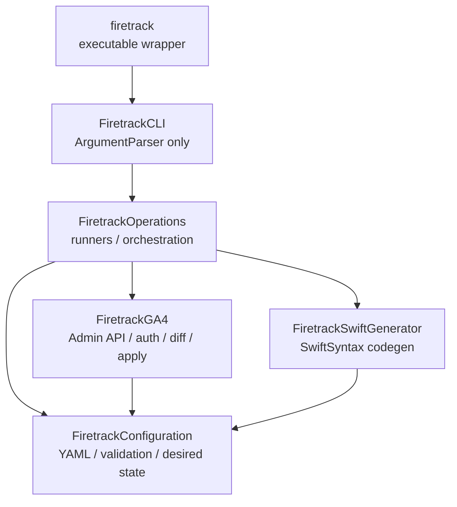

# Firetrack

Firetrack is a deterministic Firebase Analytics and GA4 Admin API toolkit. It treats `analytics-tracking-plan.yaml` as the source of truth, validates the contract, syncs missing GA4 custom definitions/key events/BigQuery links, and generates Swift event code.

## Package Shape



`Sources/firetrack` only imports `FiretrackCLI` and calls `FiretrackCommand.main()`. `FiretrackCLI` owns only ArgumentParser declarations. All logic lives in `FiretrackOperations`, `FiretrackConfiguration`, `FiretrackGA4`, or `FiretrackSwiftGenerator`.

## YAML Contract

```yaml
version: 1
platforms: [ios]
destinations:
  firebase_analytics:
    enabled: true
  ga4:
    property_id: "YOUR_GA4_PROPERTY_ID"
  bigquery:
    project_id: your-project
    project_number: "YOUR_PROJECT_NUMBER"
    dataset: analytics_YOUR_PROJECT_NUMBER

ga4_sync:
  impersonate_service_account: your-service-account@your-project.iam.gserviceaccount.com
  key_events:
    - recording_completed
  bigquery_link:
    enabled: true
    project_number: "YOUR_PROJECT_NUMBER"
    daily_export_enabled: true
    streaming_export_enabled: true
    dataset_location: US

global_parameters:
  source:
    type: enum
    allowed: [app, widget]
    ga4_custom_dimension: true

events:
  recording_completed:
    pii: false
    parameters:
      source:
        type: enum
        required: true
        ga4_custom_dimension: true
      distance_m:
        type: double
        required: true
        ga4_custom_metric: true
```

## Commands

```bash
swift run --package-path Firetrack firetrack validate \
  --plan Documents/analytics-tracking-plan.yaml

swift run --package-path Firetrack firetrack ga4 diff \
  --plan Documents/analytics-tracking-plan.yaml

swift run --package-path Firetrack firetrack ga4 sync \
  --plan Documents/analytics-tracking-plan.yaml \
  --apply

swift run --package-path Firetrack firetrack generate \
  --plan Documents/analytics-tracking-plan.yaml \
  --output /tmp/GeneratedAnalytics.swift \
  --access-level public \
  --overwrite

swift run --package-path Firetrack firetrack doctor \
  --plan Documents/analytics-tracking-plan.yaml
```

## Authentication

Firetrack resolves access tokens in this order:

1. `GOOGLE_OAUTH_ACCESS_TOKEN`
2. `ga4_sync.impersonate_service_account`, using IAMCredentials `generateAccessToken`
3. `gcloud auth print-access-token`

The impersonated token requests these scopes:

- `https://www.googleapis.com/auth/analytics.edit`
- `https://www.googleapis.com/auth/analytics.readonly`

## Safety Model

`ga4 diff` and `ga4 sync` without `--apply` are dry-runs. Apply mode only creates missing resources. Firetrack does not delete, archive, or rename GA4 resources. Existing BigQuery links to a different project are treated as a hard error.

## Swift Codegen

`firetrack generate` emits byte-stable Swift for identical YAML. The generated source is parsed with SwiftSyntax before it is written. Existing output files are not overwritten unless `--overwrite` is passed.

Generated event shape:

```swift
let event = AnalyticsEvent.recordingCompleted(
    source: .app,
    distanceM: 1200,
    durationSec: 300
)
```

## MyApp Migration

During migration, keep `Scripts/sync-ga4-analytics.rb` until Firetrack parity is proven against the real property. After parity, prefer these Make targets:

```bash
make analytics-sync-dry-run
make analytics-sync
make analytics-generate-swift
```
